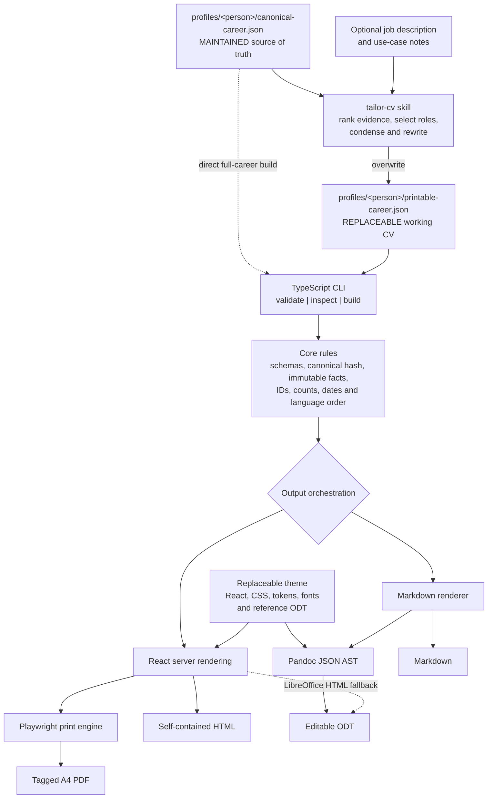

# Data-Driven CV Generator

A portable TypeScript CLI that validates [JSON Resume](https://jsonresume.org/schema/) data and renders it deterministically as PDF, self-contained HTML, Markdown, or editable ODT.

The central rule is deliberately strict: the renderer never selects or ranks career evidence, shortens prose, or rewrites content. The repository's `tailor-cv` skill (works from Codex or Claude Code) performs all editorial work and emits a self-contained printable JSON file first.

```text
canonical JSON
  -> tailor-cv skill (select, condense, rewrite with traceable evidence)
  -> printable JSON
  -> deterministic validation and rendering
  -> PDF / HTML / Markdown / ODT
```

## Quickstart

Requirements: Node.js 22+, pnpm 10+, and Playwright Chromium. Pandoc is preferred for ODT; LibreOffice is supported as a fallback.

Install the toolchain:

```sh
corepack enable
pnpm install --frozen-lockfile
pnpm exec playwright install chromium
```

Render the bundled synthetic profile to confirm the installation:

```sh
pnpm cv build profiles/example/printable-career.json --formats pdf
```

```text
pdf: /path/to/cv-generator/output/2026-09-29-AlexExample-CV-en.pdf (2 pages)
```

Every generated file is written to `output/` and named `YYYY-MM-DD-{NamePerson}-CV-{language}.{extension}`. The date is the local generation date, the person name is made filename-safe without spaces, and the language is the two-letter ISO 639-1 code resolved from `meta.x-cv.language` (English is the version 1 fallback).

Run `pnpm check` for type checking and deterministic unit/snapshot tests. `pnpm test:pdf` adds the Chromium PDF page-budget and `ats-check` tests.

The default theme is `ats`, a single-column layout that applicant tracking systems read top to bottom. See [ATS and AI screening](#ats-and-ai-screening).

## Full example: your career facts to a tailored PDF

This is the complete cycle. Steps 1 to 3 are done once. Steps 4 to 7 are repeated for every application.

### 1. Scaffold your profile

```sh
pnpm cv init jane
```

```text
canonical: /path/to/cv-generator/profiles/jane/canonical-career.json
Next steps:
  1. Replace the sample data in profiles/jane/canonical-career.json with your own career facts.
  2. Run: pnpm cv validate profiles/jane/canonical-career.json
  3. Use the tailor-cv skill to generate profiles/jane/printable-career.json
```

The command copies the synthetic example profile so you never start from an empty file. It refuses to overwrite an existing file. `profiles/jane/` is excluded by `.gitignore`, so your real career data stays on your disk.

### 2. Enter your career facts

Edit `profiles/jane/canonical-career.json`. Record the complete factual career: every role, every highlight, education, and languages. Keep the `x-cv.id` values stable, because the printable file refers to them.

This file is the maintained source of truth. You edit it when your career changes, not when you apply for a job.

### 3. Validate the canonical file

```sh
pnpm cv validate profiles/jane/canonical-career.json
```

```text
VALID canonical resume
canonical: /path/to/cv-generator/profiles/jane/canonical-career.json
```

An invalid file exits with a non-zero status and lists the errors. Correct them before you continue.

### 4. Ask the skill to tailor the CV

Open the repository in Claude Code or Codex and write the request in natural language. Save the job advertisement first, for example in `jobs/acme.txt`.

Minimal request, all defaults:

```text
Use $tailor-cv to create my general printable CV.
```

Typical request for one application:

```text
Use $tailor-cv with profiles/jane/canonical-career.json, the job description in
jobs/acme.txt, use-case notes "emphasize platform engineering", and relevant focus.
```

The skill writes `profiles/jane/printable-career.json` beside the canonical file and replaces it on every run.

### 5. What the skill does

The skill performs the editorial work that the CLI refuses to do:

1. Runs `pnpm cv validate <canonical>` and stops if the canonical data is invalid.
2. Maps each job requirement to canonical work IDs, highlights, skills, education, and languages.
3. Selects the detailed roles according to the focus strategy.
4. Writes the targeted summary, strengths, detailed roles, condensed other-experience text, education, and languages into the printable JSON, with an `x-cv.sourceId` link on every entry.
5. Copies the canonical relative path and its SHA-256 into `meta.x-cv`, plus the selected and omitted work IDs.
6. Runs `pnpm cv validate <printable>` and corrects stale hashes, ID or count mismatches, and immutable-field differences.
7. Runs `pnpm cv ats-check <printable>` (with `--job <file>` when a job description exists) and clears every ERROR and WARN by editing the JSON: parse problems, weak or generated-sounding bullets, missing canonical skills, missing job keywords.
8. Runs `pnpm cv build <printable> --formats pdf` with the default `ats` theme.
9. If the PDF exceeds two pages, revises the JSON only, in this order: remove lower-priority highlights, tighten summary and strength wording, condense role prose, then reduce the number of detailed roles.
10. Repeats validation, `ats-check` and rendering until everything passes.
11. Reports the printable path, target and focus, detailed and omitted counts, the `ats-check` summary, and the PDF path.

Without a job description the skill works in General CV mode: it sets `basics.label` to the market-standard title, sets `targetJob` to `null`, and covers every skill of the selected roles so the CV survives portal screening. The skill never invents facts, never changes the canonical file, and never edits theme typography, spacing, or page size to gain space.

### 6. Check the result

```sh
pnpm cv inspect profiles/jane/printable-career.json
```

```text
VALID printable resume
printable: /path/to/cv-generator/profiles/jane/printable-career.json
canonical: /path/to/cv-generator/profiles/jane/canonical-career.json
work: 4 detailed, 2 condensed
page budget: 2/2 PASS
```

`inspect` renders a temporary PDF for the page count and keeps no file. Validation fails if the canonical file changed after the printable file was written; run the skill again in that case.

```sh
pnpm cv ats-check profiles/jane/printable-career.json --job jobs/acme-senior-backend.txt
```

```text
ATS check: /path/to/cv-generator/profiles/jane/printable-career.json (printable, theme ats, 2 pages)

WARN  content  ai-tell-word             Reads as generated text: leveraged.  [work[1].highlights[0]]
                                        hint: Use the plain verb or fact instead.

INFO  content  bullets-with-metrics     6/9 bullets (67%) carry a number.
INFO  keywords keyword-coverage         All 13 canonical skill terms of the selected roles appear in the CV.
INFO  parse    page-count               2 pages.
INFO  job      job-keyword-coverage     18/23 job-description terms found (78%); missing: CI/CD, Datadog, Grafana, observability, Terraform.
INFO  job      title-aligned            basics.label "Senior Backend Engineer" aligns with the posting title "Senior Backend Engineer (m/f/d) - Payments Platform".

Keyword coverage: 13/13 (100%)
Job match: 18/23 (78%); title aligned: yes; missing: CI/CD, Datadog, Grafana, observability, Terraform
Result: PASS (0 errors, 1 warning, 5 info)
```

`ats-check` reads the rendered PDF back like a parser and reports, but never edits. ERROR findings exit non-zero.

### 7. Render the documents you need

The skill already produced the PDF. Generate the other formats from the same printable file:

```sh
pnpm cv build profiles/jane/printable-career.json --formats pdf,html,markdown,txt,odt
```

```text
html: /path/to/cv-generator/output/2026-09-29-JaneExample-CV-en.html
markdown: /path/to/cv-generator/output/2026-09-29-JaneExample-CV-en.md
txt: /path/to/cv-generator/output/2026-09-29-JaneExample-CV-en.txt
pdf: /path/to/cv-generator/output/2026-09-29-JaneExample-CV-en.pdf (2 pages)
odt: /path/to/cv-generator/output/2026-09-29-JaneExample-CV-en.odt (pandoc)
```

The `txt` file holds one `Label: value` per line for portals that auto-fill a form from pasted text. Add `--theme modern-europass` when a person asked for the two-column Europass look.

For the next application, return to step 4. Only the printable JSON and the rendered files change.

## ATS and AI screening

Employers run two machines before a person reads a CV:

1. A parser with a keyword filter (Workday, SAP SuccessFactors, Taleo, Personio, Greenhouse, Lever). If it cannot read the layout, the CV never reaches step 2. In a 2026 study of 2,417 scans, two-column PDFs failed parsing about 31% of the time, tables 28%, contact data in headers or footers 22%.
2. A language model that ranks the parsed text against the posting (Workday HiredScore, Lever Talent Fit, Greenhouse AI, in-house GPT or Claude pipelines). It rewards clear factual writing and a matching title, and it penalises keyword stuffing and generated-sounding prose.

This repository answers both layers without moving editorial work into code:

| Layer | What it does | Where |
| --- | --- | --- |
| `ats` theme (default) | Single column, name on line one, title line, contact line, standard headings, dates that never wrap, no footer, no icons, no tables, embedded fonts. | `themes/ats` |
| `cv ats-check` | Renders the PDF, reads the text back, and reports parse, writing and keyword findings. Deterministic, offline, read-only. | `src/core/ats` |
| `txt` output | `Label: value` plain text for portal forms. | `src/renderers/text.ts` |
| `tailor-cv` skill | General CV mode (every canonical skill covered, market-standard `basics.label`) and writing rules: action verbs, numbers, no duty phrasing, no generated-sounding vocabulary. | `.agents/skills/tailor-cv` |

`ats-check` severities: ERROR means a parser would misread the document (fails the command), WARN means the skill should change the JSON, INFO is context. The two-column `modern-europass` theme fails `ats-check` by design; keep it for human readers.

Cross-check the final PDF with free, browser-local tools when it matters: the [OpenResume parser](https://www.open-resume.com/resume-parser) shows what a Greenhouse or Lever style parser extracts, and [ats-screener](https://github.com/sunnypatell/ats-screener) simulates Workday, Taleo, iCIMS, Greenhouse, Lever and SuccessFactors scoring. Neither uploads your file. Paid matchers such as Jobscan, Resume Worded or Enhancv add job-specific keyword reports.

## `tailor-cv` skill reference

The repository skill is invoked through an agent (Codex or Claude Code) rather than as a CLI command. Parameters may be supplied naturally in the request:

| Parameter | Required | Default when omitted | Description |
| --- | --- | --- | --- |
| Canonical JSON path | Conditional | The sole `profiles/<person>/canonical-career.json` when exactly one profile exists | Complete factual profile to read. Supply this explicitly for another person or when more than one profile exists. |
| Job description | No | None | Pasted text or a file path. With no job description, the skill produces a general-purpose printable profile. |
| Use-case notes | No | None | Additional emphasis, exclusions, audience, or application context. |
| Focus | No | `balanced` | Selection strategy: `recent`, `relevant`, or `balanced`. |
| Printable JSON path | No | `printable-career.json` beside the canonical file | Single replaceable working derivative. Each skill run overwrites it instead of accumulating variant JSON files. Use another path only when an archival copy is explicitly needed. |
| Rendered document directory | No | `output/` | Destination for the verification PDF. A different directory is passed to the CLI with `--out`; the default relies on the CLI default. |

Focus strategies:

- `recent` favors chronology while retaining directly relevant older evidence.
- `relevant` favors the strongest evidence even when it is older.
- `balanced` combines recent continuity with the strongest target-specific evidence.

Request with every optional input supplied:

```text
Use $tailor-cv with profiles/jane/canonical-career.json, the job description in jobs/acme.txt,
use-case notes "emphasize platform engineering", relevant focus, printable output
profiles/jane/printable-career.json, and rendered document directory
output/acme-platform.
```

Its verification format defaults to PDF because page fitting is part of the skill workflow; additional HTML, Markdown, or ODT outputs can then be generated with `pnpm cv build`.

Claude Code auto-discovers this skill from `.claude/skills/tailor-cv` (a symlink to `.agents/skills/tailor-cv`, so both agents read the exact same instructions). To use it from claude.ai or Claude Desktop instead, zip the `.claude/skills/tailor-cv` folder and upload it as a Skill.

## Profile lifecycle

Each person has one maintained JSON file and one replaceable JSON file:

```text
profiles/<person>/
├── canonical-career.json   # edit and version this source of truth
└── printable-career.json   # replaceable skill output and render input
```

Maintain `canonical-career.json`. It contains the complete factual career and stable source IDs. Run `tailor-cv` whenever a general or job-specific CV is needed; the skill overwrites the sibling `printable-career.json`. That file is useful for review, validation, and repeatable rendering, but it is not an archive and does not need manual maintenance. The project deliberately has no `variants/` hierarchy.

The relationship is also machine-checked: `printable-career.json` stores the sibling canonical path, the canonical SHA-256, and every selected source ID. Validation rejects the printable file if the canonical file changes or immutable facts diverge. PDF, HTML, Markdown, and ODT are separate generated documents written to `output/`.

## Command reference

All commands use `pnpm cv <command>`.

| Global option or command | Short form | Default | Description |
| --- | --- | --- | --- |
| `--help` | `-h` | N/A | Show top-level help. `pnpm cv <command> --help` shows command-specific help. |
| `--version` | `-V` | N/A | Print the CLI version and exit. |
| `help [command]` | — | General help | Show help, optionally for one command. |

### `init`

```sh
pnpm cv init <name>
```

| Parameter | Required | Default | Description |
| --- | --- | --- | --- |
| `<name>` | Yes | None | Profile directory name. The command copies the example canonical file to `profiles/<name>/canonical-career.json` and refuses to overwrite an existing file. |

### `validate`

```sh
pnpm cv validate <resume>
```

| Parameter | Required | Default | Description |
| --- | --- | --- | --- |
| `<resume>` | Yes | None | Path to a standard, canonical, or printable JSON Resume. Canonical and printable files also receive the repository-specific contract checks. |

`validate` has no command options. It prints the detected resume kind and explicitly labels the resolved `canonical:` and `printable:` paths, followed by warnings or errors. Invalid input produces a non-zero exit status.

### `build`

```sh
pnpm cv build <resume> [--formats <formats>] [--theme <theme>] [--out <directory>]
```

| Parameter | Short form | Required | Default | Description |
| --- | --- | --- | --- | --- |
| `<resume>` | — | Yes | None | Path to any JSON Resume. The file is validated before rendering. |
| `--formats <formats>` | `-f` | No | `pdf` | Comma-separated output list. Accepted values are `pdf`, `html`, `markdown`, `md`, `txt`, and `odt`; `md` is an alias for `markdown`. Repeated values are ignored. |
| `--theme <theme>` | `-t` | No | `ats` | Registered theme name used for HTML and PDF and for the theme-owned ODT reference styles: `ats` (single column, parser-safe) or `modern-europass` (two-column Europass look). |
| `--out <directory>` | `-o` | No | `output` | Destination directory for every requested format. Relative paths resolve from the current working directory, and the directory is created when missing. |

Printable PDFs are limited to two pages. A longer result fails the build instead of changing content or styling.

### `inspect`

```sh
pnpm cv inspect <resume> [--theme <theme>]
```

| Parameter | Short form | Required | Default | Description |
| --- | --- | --- | --- | --- |
| `<resume>` | — | Yes | None | Path to the JSON Resume to validate and inspect. |
| `--theme <theme>` | `-t` | No | `ats` | Theme used for the temporary PDF page-budget check. |

`inspect` reports validation state and detailed/condensed work counts. For printable data it also renders a temporary PDF and reports the page budget as `<actual>/2`; it does not retain an output file.

### `ats-check`

```sh
pnpm cv ats-check <resume> [--job <file>] [--theme <theme>] [--pdf <file>] [--json]
```

| Parameter | Short form | Required | Default | Description |
| --- | --- | --- | --- | --- |
| `<resume>` | — | Yes | None | Path to the JSON Resume to check. Printable files also get canonical keyword coverage and dropped-metric checks. |
| `--job <file>` | `-j` | No | None | Job description text file. Adds keyword match and title alignment findings. |
| `--theme <theme>` | `-t` | No | `ats` | Theme used to render the temporary PDF. |
| `--pdf <file>` | — | No | None | Check an existing PDF instead of rendering one; also checks the file name convention. |
| `--json` | — | No | `false` | Print the full report as JSON for scripts and the skill. |

`ats-check` renders the CV, extracts the PDF text with pdf.js, rebuilds reading lines, and compares them with what the theme meant to print: name on line one, contact block in the first lines, every heading on its own line and in order, position, employer and date range together, no hyphen line breaks, no footer text in the flow, no multi-column merges, and no words that glue together when a strict parser drops the PDF's separate space items (`words-glued`). The content layer lints bullets (action verb, length, first person, duty phrasing, duplicates, generated-sounding words, smart typography), flags degrees without a recognised degree word such as "MSc" alone (`education-degree-unclear`), and measures canonical skill coverage. Exit status 1 when any ERROR is present. Nothing is uploaded and no model is called.

## Architecture

The application separates career facts, editorial tailoring, validation, presentation, and format conversion. This keeps the source history reviewable and ensures that rebuilding the same printable JSON produces the same content in every format.



### Data layer

The project uses exactly two sibling JSON Resume documents per person, with namespaced `x-cv` extensions:

- **`canonical-career.json`** is the durable factual record and the only file a person maintains. Work, education, and language entries have stable IDs. It grows over time and is not rewritten for individual applications.
- **`printable-career.json`** is the current complete application document. The skill replaces it as needed with the final summary, strengths, detailed roles, condensed other-experience section, education, and languages that every renderer must reproduce. It is not a collection of permanent variants.

Language facts use the `x-cv.proficiency` extension with `framework: "CEFR"`, a level from A1 through C2, and an optional `native` or `bilingual` status. The ordinary JSON Resume `fluency` field stores the same raw CEFR level. Every renderer derives one stable description: A1 Beginner, A2 Elementary, B1 Intermediate, B2 Upper Intermediate, C1 Advanced, and C2 Proficient. A status overrides the C2 description as `Native (C2)` or `Bilingual (C2)`. Languages are ordered from highest to lowest CEFR level; native and bilingual status break same-level ties before language name.

Printable metadata records its canonical relative path and SHA-256, targeting information, focus strategy, and selected and omitted IDs. This makes a printable profile auditable and lets validation detect when the canonical source changes underneath it.

### Editorial boundary

`.agents/skills/tailor-cv` is the only component allowed to select roles, rank career evidence, condense prose, or tailor claims to a job description. It writes those decisions into printable JSON before rendering. The skill has no privileged renderer behavior: after writing the file, it invokes the same public validation and build commands used manually or in CI.

The TypeScript application never performs editorial tailoring. A page-budget failure is reported back to the skill or user so the printable JSON can be revised; renderers do not silently remove content or shrink the theme.

### Core and validation

`src/core` provides the shared deterministic rules used by every output path:

- JSON loading and canonical-path resolution;
- official JSON Resume validation plus canonical and printable contracts;
- canonical SHA-256 freshness checks;
- immutable comparison of contact details, employers, roles, dates, education, and languages;
- reconciliation of selected, omitted, highlighted, and counted work IDs;
- date formatting plus deterministic CEFR language labels and proficiency-first ordering.

The CLI in `src/cli.ts` orchestrates these rules through `validate`, `inspect`, and `build`. Any JSON Resume can be built directly; canonical data is useful for full-career HTML or Markdown, while printable data is intended for application documents.

### Rendering and themes

Renderers consume validated JSON as supplied. HTML uses React server rendering and the selected theme's pure `render(resume)` contract. Playwright prints that same semantic HTML to A4 PDF: tagged for `modern-europass`, untagged for `ats`, because tagged PDFs store each joining space as its own text item and strict parsers glue the words. Markdown is generated directly from the shared model. ODT passes the Markdown representation through a Pandoc JSON AST and a theme-owned reference ODT, with LibreOffice HTML conversion as a fallback.

Presentation is isolated under `themes/<name>`. A theme owns components, design tokens, CSS, embedded fonts, and office reference styles, but it cannot select or rewrite resume content. This allows styling to evolve without changing the data workflow or tailoring skill.

### Repository map

| Path | Responsibility |
| --- | --- |
| `profiles/<person>/canonical-career.json` | Maintained complete career record and sole factual source of truth |
| `profiles/<person>/printable-career.json` | Single replaceable, self-contained CV working derivative |
| `.agents/skills/tailor-cv` | Job-specific editorial transformation and two-page revision loop |
| `.claude/skills/tailor-cv` | Symlink to the same skill, so Claude Code discovers it automatically |
| `schemas` | Canonical and printable JSON contracts layered over JSON Resume |
| `src/core` | Validation, freshness checks, immutable comparisons, and shared ordering/formatting |
| `src/core/ats` | Read-only ATS diagnostics: PDF text extraction, parse, content and job-match analysers |
| `src/renderers` | Deterministic HTML, PDF, Markdown, plain-text, and ODT orchestration |
| `themes/<name>` | Replaceable visual presentation (`ats` default, `modern-europass`) and office reference styles |
| `output` | Default ignored destination for every generated document format |
| `tests` | Contract, snapshot, page-budget, ATS diagnostics, ODT, and renderer-boundary verification |
| `Dockerfile` | Pinned Node, Chromium, Pandoc, and LibreOffice environment |

The more focused [architecture reference](docs/architecture.md) documents extension points and invariants for contributors.

## Profiles and contracts

- `profiles/<person>/canonical-career.json` is the maintained full canonical record (see `profiles/example/canonical-career.json` for a complete sample).
- `profiles/<person>/printable-career.json` is the current replaceable printable record: it is useful for review and rendering, but may be regenerated at any time.
- `schemas/canonical.schema.json` and `schemas/printable.schema.json` document the namespaced `x-cv` extensions layered over JSON Resume.
- Printable validation checks canonical SHA-256 freshness, immutable facts (including structured CEFR language data), selected/omitted ID reconciliation, highlighted older roles, and other-experience counts.

Any conforming JSON Resume can use any output format. A canonical resume naturally makes a full-career HTML/Markdown document; a printable resume makes the application documents.

## Themes and output engines

Two themes implement JSON Resume's pure `render(resume)` convention and own only presentation:

- `themes/ats` (default): single-column, parser-safe layout with standard headings, no footer and no decoration. Use it for every upload.
- `themes/modern-europass`: two-column Europass look with React server-rendered components, print/screen CSS, design tokens, embedded Noto Sans fonts and the font license, plus an ODT reference document. Use it when a person wants the Europass style on paper or screen.

- HTML is semantic, self-contained, and responsive.
- PDF is printed from the same HTML as A4 with embedded fonts and links (tagged except for `ats`); `modern-europass` adds page numbers, `ats` does not.
- Markdown is generated directly from the supplied JSON structure.
- Plain text (`txt`) emits one `Label: value` per line for portal forms.
- ODT passes through a Pandoc JSON AST when Pandoc is installed and uses the theme reference ODT; LibreOffice converts the self-contained HTML as a fallback.

See [docs/architecture.md](docs/architecture.md) for extension points and invariants.

## Docker

The pinned image includes Node, matching Playwright Chromium, Pandoc, and LibreOffice:

```sh
docker build -t cv-generator .
docker run --rm -v "$PWD:/workspace" -w /workspace cv-generator \
  build profiles/example/printable-career.json \
  --formats pdf,html,markdown,odt
```

## Privacy

Your own CV data belongs in `profiles/<you>/`, which `.gitignore` excludes by default — it stays on your disk and is never committed. `profiles/example/` is the only profile tracked in this repository; it is entirely synthetic. CI fails if any other `profiles/*/canonical-career.json` is ever staged, as a safety net against committing real data by mistake.

Version 1 is English-only, generates but does not deploy static HTML, and has no built-in LLM/API dependency beyond invoking the repository skill.

## License

MIT — see [LICENSE](LICENSE).
