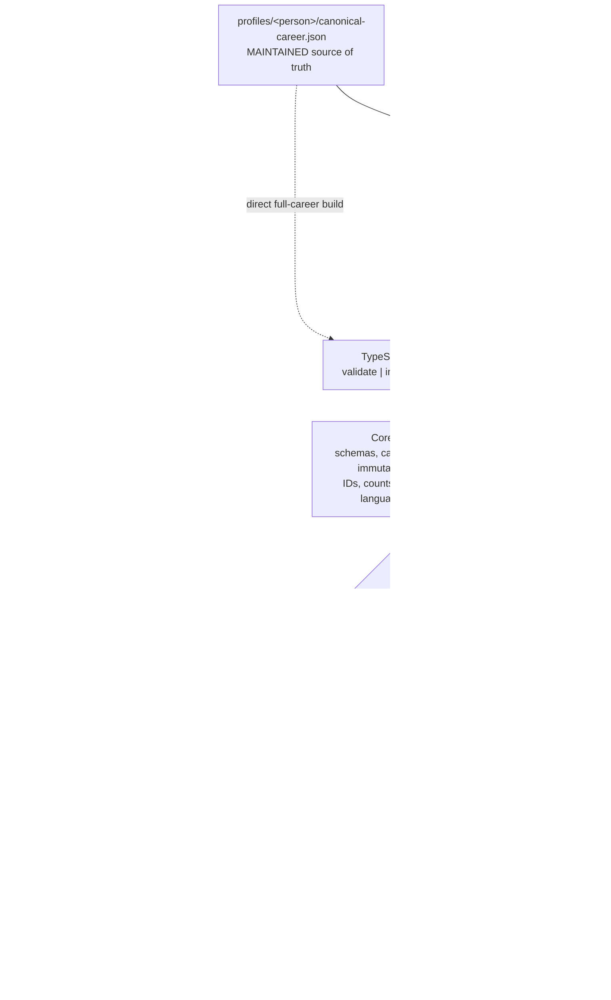

# Data-Driven CV Generator

A portable TypeScript CLI that validates [JSON Resume](https://jsonresume.org/schema/) data and renders it deterministically as PDF, self-contained HTML, Markdown, or editable ODT.

The central rule is deliberately strict: the renderer never selects or ranks career evidence, shortens prose, or rewrites content. The repository's `tailor-cv` skill (works from Codex or Claude Code) performs all editorial work and emits a self-contained printable JSON file first.

```text
canonical JSON
  -> tailor-cv skill (select, condense, rewrite with traceable evidence)
  -> printable JSON
  -> deterministic validation and rendering
  -> PDF / HTML / Markdown / ODT
```

## Quick start

Requirements: Node.js 22+, pnpm 10+, and Playwright Chromium. Pandoc is preferred for ODT; LibreOffice is supported as a fallback.

```sh
corepack enable
pnpm install --frozen-lockfile
pnpm exec playwright install chromium
pnpm cv validate profiles/example/canonical-career.json
pnpm cv inspect profiles/example/printable-career.json
pnpm cv build profiles/example/printable-career.json \
  --formats pdf,html,markdown,odt
```

Run `pnpm check` for type checking and deterministic unit/snapshot tests. `pnpm test:pdf` adds the Chromium PDF page-budget test.

By default, every generated file is written directly to `output/` and named `YYYY-MM-DD-{NamePerson}-CV-{language}.{extension}`. The date is the local generation date, the person name is made filename-safe without spaces, and the language is the two-letter ISO 639-1 code resolved from `meta.x-cv.language` (English is the version 1 fallback). For example: `output/2026-08-03-AlexExample-CV-en.pdf`.

## Create your own CV

`profiles/example/` is a complete, synthetic profile — fork it as your starting point instead of writing JSON from a blank file:

```sh
pnpm cv init <your-name>
```

This copies the example canonical file to `profiles/<your-name>/canonical-career.json`. It refuses to overwrite an existing file. Next steps:

1. Replace the sample data with your own career facts, keeping the `x-cv.id` values stable.
2. Run `pnpm cv validate profiles/<your-name>/canonical-career.json`.
3. Invoke the `tailor-cv` skill to generate `profiles/<your-name>/printable-career.json`.
4. Run `pnpm cv build profiles/<your-name>/printable-career.json --formats pdf`.

`profiles/<your-name>/` is covered by `.gitignore` by default — your real career data never gets committed unless you deliberately remove that entry.

## Profile lifecycle

Each person has one maintained JSON file and one replaceable JSON file:

```text
profiles/<person>/
├── canonical-career.json   # edit and version this source of truth
└── printable-career.json   # replaceable skill output and render input
```

Maintain `canonical-career.json`. It contains the complete factual career and stable source IDs. Run `tailor-cv` whenever a general or job-specific CV is needed; the skill overwrites the sibling `printable-career.json`. That file is useful for review, validation, and repeatable rendering, but it is not an archive and does not need manual maintenance. The project deliberately has no `variants/` hierarchy.

The relationship is also machine-checked: `printable-career.json` stores the sibling canonical path, the canonical SHA-256, and every selected source ID. Validation rejects the printable file if the canonical file changes or immutable facts diverge. PDF, HTML, Markdown, and ODT are separate generated documents written to `output/`.

## Command reference

All commands use `pnpm cv <command>`.

| Global option or command | Short form | Default | Description |
| --- | --- | --- | --- |
| `--help` | `-h` | N/A | Show top-level help. `pnpm cv <command> --help` shows command-specific help. |
| `--version` | `-V` | N/A | Print the CLI version and exit. |
| `help [command]` | — | General help | Show help, optionally for one command. |

### `validate`

```sh
pnpm cv validate <resume>
```

| Parameter | Required | Default | Description |
| --- | --- | --- | --- |
| `<resume>` | Yes | None | Path to a standard, canonical, or printable JSON Resume. Canonical and printable files also receive the repository-specific contract checks. |

`validate` has no command options. It prints the detected resume kind and explicitly labels the resolved `canonical:` and `printable:` paths, followed by warnings or errors. Invalid input produces a non-zero exit status.

### `build`

```sh
pnpm cv build <resume> [--formats <formats>] [--theme <theme>] [--out <directory>]
```

| Parameter | Short form | Required | Default | Description |
| --- | --- | --- | --- | --- |
| `<resume>` | — | Yes | None | Path to any JSON Resume. The file is validated before rendering. |
| `--formats <formats>` | `-f` | No | `pdf` | Comma-separated output list. Accepted values are `pdf`, `html`, `markdown`, `md`, and `odt`; `md` is an alias for `markdown`. Repeated values are ignored. |
| `--theme <theme>` | `-t` | No | `modern-europass` | Registered theme name used for HTML and PDF and for the theme-owned ODT reference styles. |
| `--out <directory>` | `-o` | No | `output` | Destination directory for every requested format. Relative paths resolve from the current working directory, and the directory is created when missing. |

The minimal invocation below validates the resume and creates one PDF in `output/` using `modern-europass`:

```sh
pnpm cv build profiles/example/printable-career.json
```

To generate every supported format while retaining all defaults:

```sh
pnpm cv build profiles/example/printable-career.json \
  --formats pdf,html,markdown,odt
```

Printable PDFs are limited to two pages. A longer result fails the build instead of changing content or styling.

### `inspect`

```sh
pnpm cv inspect <resume> [--theme <theme>]
```

| Parameter | Short form | Required | Default | Description |
| --- | --- | --- | --- | --- |
| `<resume>` | — | Yes | None | Path to the JSON Resume to validate and inspect. |
| `--theme <theme>` | `-t` | No | `modern-europass` | Theme used for the temporary PDF page-budget check. |

`inspect` reports validation state and detailed/condensed work counts. For printable data it also renders a temporary PDF and reports the page budget as `<actual>/2`; it does not retain an output file.

## `tailor-cv` skill parameters

The repository skill is invoked through an agent (Codex or Claude Code) rather than as a CLI command. Parameters may be supplied naturally in the request:

| Parameter | Required | Default when omitted | Description |
| --- | --- | --- | --- |
| Canonical JSON path | Conditional | The sole `profiles/<person>/canonical-career.json` when exactly one profile exists | Complete factual profile to read. Supply this explicitly for another person or when more than one profile exists. |
| Job description | No | None | Pasted text or a file path. With no job description, the skill produces a general-purpose printable profile. |
| Use-case notes | No | None | Additional emphasis, exclusions, audience, or application context. |
| Focus | No | `balanced` | Selection strategy: `recent`, `relevant`, or `balanced`. |
| Printable JSON path | No | `printable-career.json` beside the canonical file | Single replaceable working derivative. Each skill run overwrites it instead of accumulating variant JSON files. Use another path only when an archival copy is explicitly needed. |
| Rendered document directory | No | `output/` | Destination for the verification PDF. A different directory is passed to the CLI with `--out`; the default relies on the CLI default. |

The skill always validates the canonical data first, emits a self-contained printable JSON, validates it against the canonical hash and immutable facts, and generates a `modern-europass` PDF for the two-page check. Its verification format defaults to PDF because page fitting is part of the skill workflow; additional HTML, Markdown, or ODT outputs can then be generated with `pnpm cv build`.

Example with all defaults:

```text
Use $tailor-cv to create my general printable CV.
```

Example with every optional input supplied:

```text
Use $tailor-cv with profiles/jane/canonical-career.json, the job description in jobs/acme.txt,
use-case notes "emphasize platform engineering", relevant focus, printable output
profiles/jane/printable-career.json, and rendered document directory
output/acme-platform.
```

Claude Code auto-discovers this skill from `.claude/skills/tailor-cv` (a symlink to `.agents/skills/tailor-cv`, so both agents read the exact same instructions). To use it from claude.ai or Claude Desktop instead, zip the `.claude/skills/tailor-cv` folder and upload it as a Skill.

## Architecture

The application separates career facts, editorial tailoring, validation, presentation, and format conversion. This keeps the source history reviewable and ensures that rebuilding the same printable JSON produces the same content in every format.



### Data layer

The project uses exactly two sibling JSON Resume documents per person, with namespaced `x-cv` extensions:

- **`canonical-career.json`** is the durable factual record and the only file a person maintains. Work, education, and language entries have stable IDs. It grows over time and is not rewritten for individual applications.
- **`printable-career.json`** is the current complete application document. The skill replaces it as needed with the final summary, strengths, detailed roles, condensed other-experience section, education, and languages that every renderer must reproduce. It is not a collection of permanent variants.

Language facts use the `x-cv.proficiency` extension with `framework: "CEFR"`, a level from A1 through C2, and an optional `native` or `bilingual` status. The ordinary JSON Resume `fluency` field stores the same raw CEFR level. Every renderer derives one stable description: A1 Beginner, A2 Elementary, B1 Intermediate, B2 Upper Intermediate, C1 Advanced, and C2 Proficient. A status overrides the C2 description as `Native (C2)` or `Bilingual (C2)`. Languages are ordered from highest to lowest CEFR level; native and bilingual status break same-level ties before language name.

Printable metadata records its canonical relative path and SHA-256, targeting information, focus strategy, and selected and omitted IDs. This makes a printable profile auditable and lets validation detect when the canonical source changes underneath it.

### Editorial boundary

`.agents/skills/tailor-cv` is the only component allowed to select roles, rank career evidence, condense prose, or tailor claims to a job description. It writes those decisions into printable JSON before rendering. The skill has no privileged renderer behavior: after writing the file, it invokes the same public validation and build commands used manually or in CI.

The TypeScript application never performs editorial tailoring. A page-budget failure is reported back to the skill or user so the printable JSON can be revised; renderers do not silently remove content or shrink the theme.

### Core and validation

`src/core` provides the shared deterministic rules used by every output path:

- JSON loading and canonical-path resolution;
- official JSON Resume validation plus canonical and printable contracts;
- canonical SHA-256 freshness checks;
- immutable comparison of contact details, employers, roles, dates, education, and languages;
- reconciliation of selected, omitted, highlighted, and counted work IDs;
- date formatting plus deterministic CEFR language labels and proficiency-first ordering.

The CLI in `src/cli.ts` orchestrates these rules through `validate`, `inspect`, and `build`. Any JSON Resume can be built directly; canonical data is useful for full-career HTML or Markdown, while printable data is intended for application documents.

### Rendering and themes

Renderers consume validated JSON as supplied. HTML uses React server rendering and the selected theme's pure `render(resume)` contract. Playwright prints that same semantic HTML to tagged A4 PDF. Markdown is generated directly from the shared model. ODT passes the Markdown representation through a Pandoc JSON AST and a theme-owned reference ODT, with LibreOffice HTML conversion as a fallback.

Presentation is isolated under `themes/<name>`. A theme owns components, design tokens, CSS, embedded fonts, and office reference styles, but it cannot select or rewrite resume content. This allows styling to evolve without changing the data workflow or tailoring skill.

### Repository map

| Path | Responsibility |
| --- | --- |
| `profiles/<person>/canonical-career.json` | Maintained complete career record and sole factual source of truth |
| `profiles/<person>/printable-career.json` | Single replaceable, self-contained CV working derivative |
| `.agents/skills/tailor-cv` | Job-specific editorial transformation and two-page revision loop |
| `.claude/skills/tailor-cv` | Symlink to the same skill, so Claude Code discovers it automatically |
| `schemas` | Canonical and printable JSON contracts layered over JSON Resume |
| `src/core` | Validation, freshness checks, immutable comparisons, and shared ordering/formatting |
| `src/renderers` | Deterministic HTML, PDF, Markdown, and ODT orchestration |
| `themes/<name>` | Replaceable visual presentation and office reference styles |
| `output` | Default ignored destination for every generated document format |
| `tests` | Contract, snapshot, page-budget, ODT, and renderer-boundary verification |
| `Dockerfile` | Pinned Node, Chromium, Pandoc, and LibreOffice environment |

The more focused [architecture reference](docs/architecture.md) documents extension points and invariants for contributors.

## Tailoring an application

Invoke the repository skill from Codex or Claude Code, for example:

```text
Use $tailor-cv with profiles/example/canonical-career.json, balanced focus, and
this job description. Replace profiles/example/printable-career.json.
```

The skill validates the canonical profile, targets the evidence, writes all summary/strength/other-experience prose and selections into printable JSON, then validates and renders it. If the PDF exceeds two pages, the skill revises JSON content in the documented order; it does not change theme typography or spacing.

## Profiles and contracts

- `profiles/<person>/canonical-career.json` is the maintained full canonical record (see `profiles/example/canonical-career.json` for a complete sample).
- `profiles/<person>/printable-career.json` is the current replaceable printable record: it is useful for review and rendering, but may be regenerated at any time.
- `schemas/canonical.schema.json` and `schemas/printable.schema.json` document the namespaced `x-cv` extensions layered over JSON Resume.
- Printable validation checks canonical SHA-256 freshness, immutable facts (including structured CEFR language data), selected/omitted ID reconciliation, highlighted older roles, and other-experience counts.

Any conforming JSON Resume can use any output format. A canonical resume naturally makes a full-career HTML/Markdown document; a printable resume makes the application documents.

## Themes and output engines

`themes/modern-europass` owns only presentation: React server-rendered components, print/screen CSS, design tokens, embedded Noto Sans fonts and the font license, plus an ODT reference document. It implements JSON Resume's pure `render(resume)` convention.

- HTML is semantic, self-contained, and responsive.
- PDF is printed from the same HTML with tagged A4 output, embedded fonts, links, and page numbers.
- Markdown is generated directly from the supplied JSON structure.
- ODT passes through a Pandoc JSON AST when Pandoc is installed and uses the theme reference ODT; LibreOffice converts the self-contained HTML as a fallback.

See [docs/architecture.md](docs/architecture.md) for extension points and invariants.

## Docker

The pinned image includes Node, matching Playwright Chromium, Pandoc, and LibreOffice:

```sh
docker build -t cv-generator .
docker run --rm -v "$PWD:/workspace" -w /workspace cv-generator \
  build profiles/example/printable-career.json \
  --formats pdf,html,markdown,odt
```

## Privacy

Your own CV data belongs in `profiles/<you>/`, which `.gitignore` excludes by default — it stays on your disk and is never committed. `profiles/example/` is the only profile tracked in this repository; it is entirely synthetic. CI fails if any other `profiles/*/canonical-career.json` is ever staged, as a safety net against committing real data by mistake.

Version 1 is English-only, generates but does not deploy static HTML, and has no built-in LLM/API dependency beyond invoking the repository skill.

## License

MIT — see [LICENSE](LICENSE).
